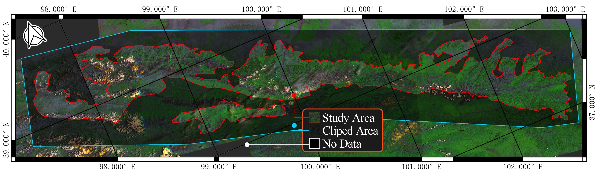

# Data preprocess 

Data process for papper titled [Forestry digital twin with machine learning in Landsat 7 data]() (Link TBD).

Remote sesing dataset from [Earth Explorer](https://earthexplorer.usgs.gov/), filled (gap-filling), merged, and clipped using QGIS to obtain the complete study area from GDAL library and GRASS7 library.

WRS coordinates are 132034, 133033, 134033, and 135033.

Preprocess data are available from [kaggle](https://www.kaggle.com/datasets/jchrysanthemum/qmnp-landsat7?select=Dataset)
